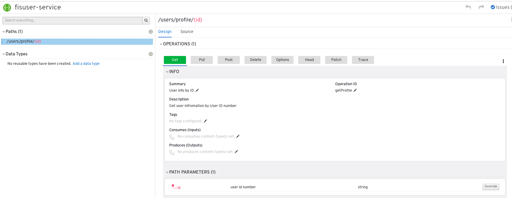
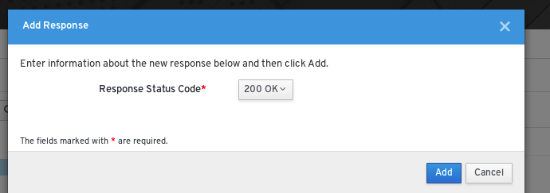

# User Profile Service

This demo demonstrates how to use Apicurio for design OpenAPI using contract-first approach along with Red Hat Fuse/Camel's and generate the Red Hat Fuse project and use REST DSL to expose a RESTful API.

This example relies on the Fabric8 Maven plugin for its build configuration and uses the FIS Java base image


### Defining the Application with the OpenAPI Specification in Apicurio  

Create the API (service).

 ")

Start adding the paths to the document.

 


Add parameters and define their type.

 
  

Add Operation

 


Add responses

 

Preview API

  

Publish API on GitHub  
  
Add the generated API specification document to the directory src/spec/.

<p align="left">
  
</p>


###  Integrate the Standard API Document with Red Hat Fuse


I used Red Hat Developer Studio and generate New->Fuse Integration Project and given name 'fisuser-service'

We are going to use a microservices approach, so select the most-popular runtime—Spring Boot. 

My generated API specification document saved under directory src/spec/
  
  
  <p align="left">
  
 </p>

Edit the pom.xml file, and add the following to it:

```xml

<plugins>
....
<plugin>
  <groupId>org.apache.camel</groupId>
  <artifactId>camel-restdsl-swagger-plugin</artifactId>
  <version>2.21.0</version>
  <configuration>
    <specificationUri>src/spec/userservice-spec.json</specificationUri>
    <fileName>camel-rest.xml</fileName>
    <outputDirectory>src/main/resources/spring</outputDirectory>    
  </configuration>
</plugin>
....
</plugin>

```

Generate the XML by running the following in the command-line tool:  

```
mvn camel-restdsl-swagger:generate-xml

```
<p align="left">
  
</p>


You will then find a newly generated Camel context named camel-rest.xml, which has all the path implementations in Camel.

<p align="left">
  
</p>


From that file, copy everything inside the < rests > tags and paste it into the original camel-context.xml file inside camelContext. Add the following rest configuration on top of the rest block

```xml

  <restConfiguration apiContextPath="api-docs" bindingMode="json"
            component="servlet" contextPath="/cicd" enableCORS="true">
            <apiProperty key="cors" value="true"/>
            <apiProperty key="api.title" value="User Service"/>
            <apiProperty key="api.version" value="1.0.0"/>
            <corsHeaders key="Access-Control-Allow-Origin" value="*"/>
            <corsHeaders key="Access-Control-Allow-Methods" value="GET, HEAD, POST, PUT, DELETE, TRACE, OPTIONS, CONNECT, PATCH"/>
            <corsHeaders key="Access-Control-Allow-Headers" value="Origin, Accept, X-Requested-With, Content-Type, Access-Control-Request-Method, Access-Control-Request-Headers"/>
        </restConfiguration>
       // generated rest block add as below after rest configuration
        <rest>
        <get id="getProfile" uri="/users/profile/{id}">
            <description>Get user information by User ID number</description>
            <param dataType="string" description="user id number" name="id" required="true" type="path"/>
            <to uri="direct:getProfile"/>
        </get>
    	</rest>
        
  ```
  
Delete the generated camel-rest.xml file.

### Mocking the APIs with Apache Camel

add a beans.xml file by right-clicking the folder and selecting New->beans.xml File.

Insert the following code snippet to the beans.xml file:

```xml

<?xml version="1.0" encoding="UTF-8"?>
<beans xmlns="http://www.springframework.org/schema/beans"
 xmlns:util="http://www.springframework.org/schema/util"
    xmlns:xsi="http://www.w3.org/2001/XMLSchema-instance" xsi:schemaLocation="        
    http://www.springframework.org/schema/beans http://www.springframework.org/schema/beans/spring-beans.xsd        
    http://camel.apache.org/schema/spring       http://camel.apache.org/schema/spring/camel-spring.xsd

    http://www.springframework.org/schema/util http://www.springframework.org/schema/util/spring-util.xsd">
<util:list id="UserProfileList" list-class="java.util.ArrayList">
   <ref bean="UserProfile"/>
</util:list>
<util:map id="UserProfile" map-class="java.util.HashMap">
   <entry key="firstName" value="Abdul"/>
   <entry key="lastName" value="Hameed"/>
   <entry key="email" value="xyz@gmail.com"/>
   <entry key="phone" value="12345678"/>
   <entry key="addr" value="28 st town state zipcode "/>
   <entry key="state" value="MA"/>

</util:map>
</beans>

  ```
Add the Camel routes to the camel-context.xml file.

```xml

        <route id="user profile route">
            <from id="_from1" uri="direct:getProfile"/>
            <log id="_log1" message="Profile ${headers.id}"/>
             <to uri="bean:UserProfileList?method=get(0)"/>
            <log id="_log2" message="output: ${body}"/>
        </route>
  ```


In Project Explorer, select a routing context file.
Right-click it to open the context menu, and then select Run As → Local Camel Context.
        

### Building

The example can be built with

```
    mvn clean install

 ```
    
    
### Running the example locally

Using Red Hat Developer Studio

In Project Explorer, select a routing context file.

Right-click it to open the context menu, and then select Run As → Local Camel Context.


or can be run locally using the following Maven goal:

```
   $ mvn spring-boot:run
    
```
You can then access the REST API directly from your Web browser, e.g.:

   - <http://localhost:8080/cicd/users/profile/11111>
   
 ```json
   
   {"firstName":"Abdul","lastName":"Hameed","phone":"12345678","state":"MA","addr":"28 st town state zipcode ","email":"xyz@gmail.com"}
   
 ```
view the API Doc       
   
   - <http://localhost:8080/cicd/api-docs>    
    
### Implementation 
        

This is a Fuse Service that use SQL component to connect to a table in database, that retrieves particular user profile by providing the profile id and return out as a JSON format.

  

```xml

   <to id="_to1" uri="sql:select * from userprofile where id=:#id?outputClass=com.redhat.myfispipeline.UserProfiles&amp;dataSource=dataSource&amp;outputType=SelectOne"/>
   <!-- <to uri="bean:UserProfileList?method=get(0)"/> -->         
  
  ```

This uses an embedded in-memory HSQLDB database. You can use the default Spring Boot profile in case you have a MySQL server available for you to test.

You can then access and verify the data from database, user id should be available in database .:


- <http://localhost:8080/cicd/user/profile/11111>   

### Running the example in OpenShift

It is assumed that:
- OpenShift platform is already running, if not you can find details how to [Install OpenShift at your site](https://docs.openshift.com/container-platform/3.3/install_config/index.html).
- Your system is configured for Fabric8 Maven Workflow, if not you can find a [Get Started Guide](https://access.redhat.com/documentation/en/red-hat-jboss-middleware-for-openshift/3/single/red-hat-jboss-fuse-integration-services-20-for-openshift/)

The example can be built and run on OpenShift using a single goal, the mysql database should already setup in your environment see the setup.sh file inside setup dir for more details

   ```
   mvn fabric8:deploy -Dmysql-service-username=dbuser -Dmysql-service-password=password
  ```

When the example runs in OpenShift, you can use the OpenShift client tool to inspect the status

To list all the running pods:

    oc get pods

Then find the name of the pod that runs this quickstart, and output the logs from the running pods with:

    oc logs <name of pod>

You can also use the OpenShift [web console](https://docs.openshift.com/container-platform/3.3/getting_started/developers_console.html#developers-console-video) to manage the
running pods, and view logs and much more.

### Running via an S2I Application Template

Application templates allow you deploy applications to OpenShift by filling out a form in the OpenShift console that allows you to adjust deployment parameters.  This template uses an S2I source build so that it handle building and deploying the application for you.

First, import the Fuse image streams:

    oc create -f https://raw.githubusercontent.com/jboss-fuse/application-templates/GA/fis-image-streams.json

Then create the quickstart template:

    oc create -f https://raw.githubusercontent.com/jboss-fuse/application-templates/GA/quickstarts/spring-boot-camel-template.json

Now when you use "Add to Project" button in the OpenShift console, you should see a template for this quickstart. 

